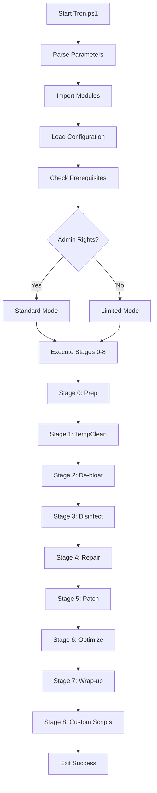

# Tron PowerShell Architecture

This document describes the architecture and design of the Tron PowerShell port.

## Overview

Tron PowerShell is a complete rewrite of the original Tron batch script in native PowerShell. The architecture is designed to be modular, maintainable, and extensible while preserving the core functionality of the original Tron.

## Design Principles

1. **Modularity** - Separate concerns into distinct modules
2. **Maintainability** - Clear code structure and documentation
3. **Safety** - DryRun mode and comprehensive error handling
4. **Extensibility** - Easy to add new stages and features
5. **Compatibility** - Maintains compatibility with existing Tron resources

## Directory Structure

```
tron_PowerShell/
├── Tron.ps1                 # Main entry point
├── Debug-Tron.ps1          # Sandbox testing script
├── build_release.ps1       # Build script for releases
├── Modules/                # PowerShell modules
│   ├── Tron.Core.psm1     # Core functions
│   └── Tron.Stages.psm1   # Stage implementations
├── Config/                 # Configuration
│   └── defaults.json      # Default configuration
└── Resources/             # External tools and scripts
    ├── stage_0_prep/
    ├── stage_1_tempclean/
    ├── stage_2_de-bloat/
    ├── stage_3_disinfect/
    ├── stage_4_repair/
    ├── stage_5_patch/
    ├── stage_6_optimize/
    ├── stage_7_wrap-up/
    └── stage_8_custom_scripts/
```

## Core Components

### 1. Main Entry Point (`Tron.ps1`)

The main script handles:
- **Parameter Parsing** - Command-line switches (`-DryRun`, `-Verbose`, etc.)
- **Module Loading** - Imports Core and Stages modules
- **Configuration** - Loads and applies configuration settings
- **Prerequisite Checks** - OS version, admin rights, PowerShell version
- **Stage Orchestration** - Calls each stage function in sequence
- **Error Handling** - Top-level try/catch and logging

**Flow:**
```
1. Parse parameters
2. Import modules
3. Load configuration
4. Check prerequisites
5. Execute stages (0-8)
6. Handle errors and exit
```

### 2. Core Module (`Tron.Core.psm1`)

Provides foundational functions used across all stages.

#### Global State (`$Global:TronState`)

Centralized state management:
```powershell
$Global:TronState = @{
    Config  = $null      # Configuration object
    LogFile = $null      # Log file path
    IsAdmin = $false     # Admin privilege status
    Mode    = "Standard" # Execution mode
}
```

**Modes:**
- `Standard` - Full execution with admin rights
- `Limited` - Non-admin execution (skips privileged tasks)
- `DryRun` - Simulation mode (no actual changes)

#### Core Functions

| Function | Purpose |
|----------|---------|
| `Write-TronLog` | Unified logging to console and file |
| `Get-TronConfig` | Loads configuration from JSON |
| `Test-IsAdmin` | Checks for administrator privileges |
| `Initialize-TronLogging` | Sets up logging infrastructure |

### 3. Stages Module (`Tron.Stages.psm1`)

Implements the logic for each Tron stage.

#### Stage Functions

Each stage is implemented as a separate function:

```powershell
function Invoke-Stage0 { }  # Prep
function Invoke-Stage1 { }  # TempClean
function Invoke-Stage2 { }  # De-bloat
function Invoke-Stage3 { }  # Disinfect
function Invoke-Stage4 { }  # Repair
function Invoke-Stage5 { }  # Patch
function Invoke-Stage6 { }  # Optimize
function Invoke-Stage7 { }  # Wrap-up
function Invoke-Stage8 { }  # Custom Scripts
```

#### Stage Pattern

Each stage follows a consistent pattern:

```powershell
function Invoke-StageX {
    Write-TronLog "Stage X: Name begin..."
    
    # Get resource paths
    $ResourcesPath = "$PSScriptRoot\..\Resources\"
    $StagePath = "$ResourcesPath\stage_X_name\"
    
    # Execute sub-tasks
    if (-not $Global:TronState.Config.DryRun) {
        # Actual work here
    }
    
    Write-TronLog "Stage X: Name complete."
}
```

### 4. Configuration System (`Config/defaults.json`)

JSON-based configuration for flexibility:

```json
{
  "DryRun": false,
  "Verbose": false,
  "Autorun": false,
  "SkipDebloat": false,
  "SkipUpdate": false,
  "PreserveMetroApps": false,
  "SkipCookieCleanup": false,
  "SkipMbam": false,
  "LogFile": "C:\\Logs\\tron\\tron.log",
  "RawLogsPath": "C:\\Logs\\tron_raw_logs"
}
```

**Configuration Priority:**
1. Command-line parameters (highest)
2. Configuration file values
3. Built-in defaults (lowest)

### 5. Resource Management

External tools are organized by stage in the `Resources/` directory.

**Resource Types:**
- **Executables** - Third-party tools (e.g., `rkill.exe`, `ccleaner.exe`)
- **Scripts** - Batch and PowerShell scripts
- **Data Files** - Lists, configurations, and databases
- **Libraries** - DLLs and dependencies

**Compatibility:** The resource directory structure mirrors the original Tron batch version for easy tool updates.

## Execution Flow

### Normal Execution



### DryRun Mode

When `-DryRun` is specified:
- All stages execute
- `$Global:TronState.Config.DryRun` is set to `true`
- Each stage checks this flag before performing destructive operations
- Actions are logged but not executed

### Limited Mode

When running without admin rights:
- Privileged operations are skipped:
  - DISM and SFC checks
  - System restore point creation
  - Metro app removal
  - Registry modifications requiring HKLM access
- User-level cleanup continues:
  - Temp file removal
  - Browser cache cleanup
  - User registry modifications

## Logging System

### Log Levels

| Level | Purpose | Color |
|-------|---------|-------|
| `INFO` | General information | White |
| `WARN` | Warnings and skipped tasks | Yellow |
| `ERROR` | Errors and failures | Red |
| `DEBUG` | Verbose debugging info | Gray |

### Log Output

Logs are written to:
1. **Console** - Real-time colored output
2. **Log File** - Persistent file log (specified in config)
3. **Transcript** - Complete PowerShell session capture

### Log Format

```
[YYYY-MM-DD HH:MM:SS] [LEVEL] Message
```

Example:
```
[2025-11-27 14:32:15] [INFO] Tron PowerShell Edition v1.0.0 Initialized
[2025-11-27 14:32:16] [WARN] Tron is NOT running as Administrator.
[2025-11-27 14:32:16] [INFO] Stage 0: Prep begin...
```

## Error Handling

### Strategy

1. **Top-Level Handler** - Main `try/catch` in `Tron.ps1`
2. **Stage-Level Handlers** - Each stage handles its own errors
3. **Graceful Degradation** - Failed operations are logged and skipped
4. **Clean Shutdown** - Ensures logs are written before exit

### Error Actions

```powershell
$ErrorActionPreference = "Stop"  # Catch all errors
```

Individual commands use `-ErrorAction SilentlyContinue` when failures are acceptable.

## Sandbox Testing (`Debug-Tron.ps1`)

Allows safe testing without affecting the real system.

**How it works:**
1. Creates `Sandbox/` directory in project root
2. Populates with mock files and directories
3. Redirects Tron to operate within sandbox
4. Executes stages in isolation

**Use case:** Testing file cleanup logic, stage implementations, and new features.

## Future Architecture Enhancements

### Planned Improvements

1. **Plugin System** - Allow third-party stage extensions
2. **Event System** - Pre/post stage hooks for custom logic
3. **Parallel Execution** - Run independent tasks concurrently
4. **Remote Execution** - Run Tron on remote machines
5. **GUI Option** - Windows Forms or WPF interface
6. **Configuration Profiles** - Named profiles for different use cases
7. **Rollback System** - Ability to undo changes

### Modularization Goals

- Separate each stage into its own module file
- Create utility modules for common patterns
- Implement dependency injection for better testing
- Add unit tests for core functions

## Comparison to Batch Version

| Aspect | Batch Version | PowerShell Version |
|--------|---------------|-------------------|
| Language | Batch script | PowerShell |
| Structure | Monolithic | Modular |
| Error Handling | Basic | Comprehensive |
| Testing | Manual | Sandbox + DryRun |
| Configuration | Hardcoded | JSON-based |
| Logging | Basic text | Structured levels |
| Extensibility | Limited | High |
| Maintainability | Difficult | Easy |

## Contributing to Architecture

When adding new features:

1. **Follow the Module Pattern** - Use existing modules or create new ones
2. **Respect State Management** - Use `$Global:TronState` for shared state
3. **Implement DryRun** - Always check `Config.DryRun` before destructive operations
4. **Add Logging** - Use `Write-TronLog` for all significant actions
5. **Handle Errors** - Use try/catch and appropriate `ErrorAction` settings
6. **Document** - Update this document for architectural changes

## Additional Resources

- [Building Guide](BUILDING.md)
- [Contributing Guidelines](CONTRIBUTING.md)
- [Security Policy](SECURITY.md)
- [Main README](README.md)

---

**Questions about the architecture?** Open an issue: https://github.com/thookham/tron_PowerShell/issues
