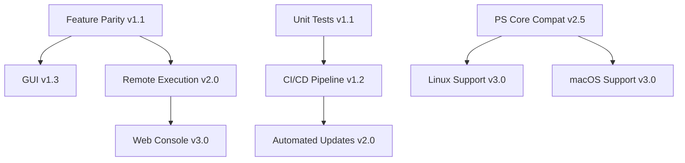

# Tron PowerShell Roadmap

This document outlines the planned development trajectory for Tron PowerShell. The roadmap is organized into short-term (3-6 months), medium-term (6-12 months), and long-term (12+ months) goals.

> [!NOTE]
> This roadmap is subject to change based on community feedback, security priorities, and resource availability. Dates are estimates and may shift.

---

## Vision Statement

Transform Tron into a modern, cross-platform, enterprise-ready system maintenance platform while maintaining its core mission: automated PC cleanup and repair that "just works."

---

## Current Status (v1.0.x)

### ✅ Completed

- Native PowerShell rewrite of core functionality
- Modular architecture (Core + Stages modules)
- Support for all 8 stages from the original Tron
- DryRun mode for safe testing
- Sandbox testing environment (`Debug-Tron.ps1`)
- Limited Mode (non-admin execution)
- JSON-based configuration system
- Comprehensive logging system
- Build automation for releases

### 🚧 Known Limitations

- Stage implementations are not yet feature-complete compared to batch version
- No automated testing infrastructure
- No GUI option
- Limited progress reporting
- Some legacy batch scripts still in use for complex operations
- Resource update process is manual

---

## Short-Term Goals (3-6 months)

**Focus:** Feature parity, stability, and developer experience

### Core Functionality

- [ ] **Complete Stage Implementations**
  - Fully implement all sub-tasks in each stage to match batch version functionality
  - [/] Eliminate any remaining batch script dependencies
  - Priority: Stages 3 (Disinfect) and 4 (Repair) - **Stage 4 Complete**

- [ ] **Enhanced Error Handling**
  - Implement retry logic for network-dependent operations
  - Add better error messages with actionable guidance
  - Create error recovery mechanisms for critical failures

- [ ] **Progress Reporting**
  - Add progress indicators for long-running operations
  - Implement estimated time remaining calculations
  - Create summary statistics (files removed, space freed, etc.)

### Developer Experience

- [ ] **Unit Testing Framework**
  - Set up Pester testing infrastructure
  - Create tests for core module functions
  - Achieve 60%+ code coverage
  - Integrate tests into build process

- [ ] **Improved Debugging Tools**
  - Enhance `Debug-Tron.ps1` with more realistic mock data
  - Add verbose timing information for performance profiling
  - Create development mode with additional logging

- [ ] **Code Quality**
  - Implement PSScriptAnalyzer checks
  - Enforce consistent code style
  - Add inline documentation and examples
  - Create developer guide

### Documentation

- [ ] **User Documentation**
  - Create troubleshooting guide
  - Add FAQ section
  - Document common use cases and scenarios
  - Create video walkthrough

- [ ] **API Documentation**
  - Document all exported functions
  - Add parameter descriptions and examples
  - Create module usage guides

### Configuration

- [ ] **Configuration Profiles**
  - Support for named configuration profiles
  - Pre-made profiles (Conservative, Aggressive, Enterprise)
  - Easy profile switching
  - Profile validation

- [ ] **Advanced Options**
  - Per-stage skip flags
  - Custom tool paths
  - Network proxy support
  - Log retention policies

---

## Medium-Term Goals (6-12 months)

**Focus:** User experience, automation, and enterprise features

### User Interface

- [ ] **GUI Option**
  - Windows Forms or WPF-based interface
  - Stage selection and configuration
  - Real-time progress visualization
  - Log viewer integration
  - Run as standalone application

- [ ] **Interactive Mode**
  - Prompt users before each stage
  - Show preview of actions
  - Allow selective execution
  - Customizable automation level

### Reporting & Analytics

- [ ] **Enhanced Reports**
  - HTML-formatted execution reports
  - Before/after system snapshots
  - Detailed action audit trail
  - Performance metrics and charts

- [ ] **Export Capabilities**
  - Export logs to JSON/XML/CSV
  - Generate summary PDFs
  - Email report delivery
  - Integration with ticketing systems

### Remote Management

- [ ] **Remote Execution**
  - PSRemoting support for running on remote machines
  - Bulk execution across multiple systems
  - Centralized logging and reporting
  - Status monitoring dashboard

- [ ] **Scheduled Tasks**
  - Easy scheduled task creation
  - Recurring maintenance windows
  - Automatic update checks
  - Email notifications on completion

### Resource Management

- [ ] **Automated Tool Updates**
  - Automatic detection of tool updates
  - Safe update mechanism with rollback
  - Signature verification for security
  - Update changelog tracking

- [ ] **Tool Management**
  - Download tools on-demand instead of bundling
  - Configurable tool repositories
  - Tool verification and sandboxing
  - Size optimization

### Enterprise Features

- [ ] **Active Directory Integration**
  - GPO-based configuration deployment
  - Computer/user group targeting
  - Centralized configuration management
  - Compliance reporting

- [ ] **Custom Extensions**
  - Plugin system for custom stages
  - Pre/post stage hooks
  - Custom cleanup scripts API
  - Community plugin marketplace

---

## Long-Term Goals (12+ months)

**Focus:** Platform expansion, intelligence, and ecosystem

### Cross-Platform Support

- [ ] **PowerShell Core Compatibility**
  - Refactor for PowerShell 7+ compatibility
  - Cross-platform module structure
  - Platform-specific stage implementations

- [ ] **Linux Support**
  - Linux-specific cleanup stages
  - Package manager integration (apt, yum, dnf)
  - systemd service management
  - Log aggregation

- [ ] **macOS Support**
  - macOS-specific maintenance tasks
  - Homebrew integration
  - LaunchAgent management
  - Disk utility integration

### Intelligence & Automation

- [ ] **Smart Cleanup**
  - Machine learning for bloatware detection
  - Usage patterns analysis for safe removal
  - Anomaly detection for system issues
  - Predictive maintenance recommendations

- [ ] **Context-Aware Execution**
  - Detect system role (workstation, server, etc.)
  - Adjust behavior based on environment
  - Hardware-specific optimizations
  - Workload-aware scheduling

### Cloud Integration

- [ ] **Cloud Backup**
  - Pre-execution system backups to cloud storage
  - Configuration backup and sync
  - Centralized log storage
  - Disaster recovery options

- [ ] **Cloud-Based Updates**
  - Cloud-hosted tool repository
  - CDN-based distribution
  - Delta updates for efficiency
  - Automatic rollback on failures

### Ecosystem Development

- [ ] **Web Console**
  - Web-based management interface
  - Multi-system monitoring
  - Centralized configuration
  - REST API for integrations

- [ ] **Mobile App**
  - iOS/Android monitoring apps
  - Push notifications
  - Remote execution triggers
  - Quick status checks

- [ ] **Integration Platform**
  - Webhook support
  - Third-party tool integrations
  - Monitoring system connectors (Nagios, Zabbix, etc.)
  - SIEM integration

### Advanced Features

- [ ] **Rollback System**
  - Full system state snapshots
  - Granular rollback by stage
  - Automatic rollback on critical errors
  - Differential restore capabilities

- [ ] **Containerization**
  - Docker image for testing
  - Docker-based tool isolation
  - Container orchestration support
  - Disposable test environments

- [ ] **Compliance & Security**
  - CIS benchmark alignment
  - Security hardening profiles
  - Compliance verification reporting
  - Audit trail with digital signatures

---

## Community & Support

### Community Building

- [ ] **Community Forums**
  - Dedicated discussion platform
  - User support channels
  - Feature request voting
  - Knowledge base

- [ ] **Contribution Programs**
  - Contributor recognition system
  - Bounty program for features/bugs
  - Sponsored development
  - Community events and webinars

### Documentation & Education

- [ ] **Comprehensive Guides**
  - Video tutorial series
  - Interactive documentation
  - Best practices guide
  - Case studies and examples

- [ ] **Training Materials**
  - Certification program
  - Workshop materials
  - Partner training
  - Academic resources

---

## Version Milestones

| Version | Target Date | Key Features |
|---------|-------------|--------------|
| v1.1.0 | Q1 2026 | Feature parity with batch version, unit tests |
| v1.2.0 | Q2 2026 | Progress reporting, configuration profiles |
| v1.3.0 | Q3 2026 | GUI option, enhanced logging |
| v2.0.0 | Q4 2026 | Remote execution, automated updates, enterprise features |
| v2.5.0 | Q2 2027 | PowerShell Core support, cross-platform foundation |
| v3.0.0 | Q4 2027 | Linux/macOS support, cloud integration |

---

## How to Contribute to the Roadmap

We welcome community input on the roadmap!

### Provide Feedback

- Comment on existing roadmap items in GitHub Discussions
- Vote for features using issue reactions (👍)
- Share your use cases and requirements

### Propose New Features

1. Open a GitHub Discussion in the "Ideas" category
2. Describe the feature and its benefits
3. Explain your use case
4. Gather community feedback

### Sponsor Development

- Critical features can be prioritized through sponsorship
- Contact maintainers for enterprise support contracts
- Contribute code directly via pull requests

---

## Dependencies & Prerequisites

Some roadmap items depend on others:

---

## Notes on Priorities

### Security First

Security fixes and vulnerability patches will always take priority over new features.

### Backward Compatibility

We will maintain backward compatibility within major versions. Breaking changes will only occur in major version updates (e.g., v1.x → v2.0).

### Community-Driven

Feature prioritization will be influenced by community feedback, contribution levels, and real-world usage patterns.

---

## Additional Resources

- [Contributing Guidelines](CONTRIBUTING.md)
- [Architecture Documentation](ARCHITECTURE.md)
- [Building Guide](BUILDING.md)
- [Security Policy](SECURITY.md)
- [Main README](README.md)

---

**Last Updated:** 2025-12-01

**Questions or suggestions?** Open a discussion: <https://github.com/thookham/tron_PowerShell/discussions>
